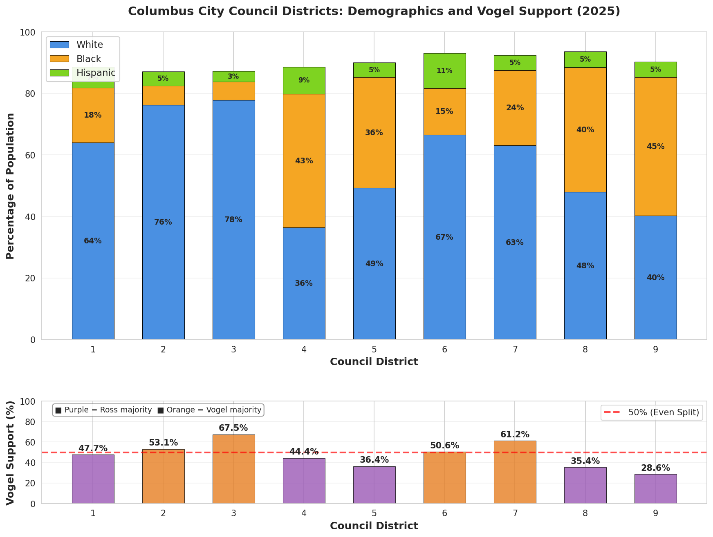

# Columbus City Council District 7 Race Analysis (2025)

## Overview

The 2025 Columbus City Council District 7 race between **Jesse Vogel** (progressive challenger) and **Tiara Ross** (Franklin County Democratic Party-endorsed candidate) was an **at-large citywide election** where all Columbus voters could participate, regardless of district. The results exposed deep fissures within Columbus Democrats, with Ross winning by just 1,621 votes (1.6 points).

**Note**: While candidates must reside in their district, Columbus City Council elections are at-large citywide races.

## Race Results

**Winner**: Tiara Ross (party-endorsed Democrat)
- **Ross**: 53,291 votes (50.8%)
- **Vogel**: 51,670 votes (49.2%)
- **Margin**: 1,621 votes (1.6 percentage points)

Ross's victory was built on the traditional Democratic base - Black voters and working-class neighborhoods - while Vogel's progressive challenge drew support primarily from white, college-educated, gentrifying areas.

## Columbus City Council Districts

| District | Winner | Vogel % | Demographics |
|----------|--------|---------|--------------|
| District 1 | **Ross** | 47.7% | 64% White, 18% Black |
| District 2 | **Vogel** | 53.1% | 76% White, 6% Black |
| District 3 | **Vogel** | 67.5% | 78% White, 6% Black |
| District 4 | **Ross** | 44.4% | 36% White, 43% Black |
| District 5 | **Ross** | 36.4% | 49% White, 36% Black |
| District 6 | **Vogel** | 50.6% | 67% White, 15% Black, 11% Hispanic |
| **District 7** | **Vogel** | **61.2%** | **63% White, 24% Black** |
| District 8 | **Ross** | 35.4% | 48% White, 40% Black |
| District 9 | **Ross** | 28.6% | 40% White, 45% Black |

**Key Pattern**: Vogel won the four whitest districts (2, 3, 6, 7), while Ross dominated districts with higher Black populations (4, 5, 8, 9).

## Geographic Voting Patterns

**548 Columbus precincts analyzed**

### By Racial Composition

| Precinct Type | Count | Avg Vogel Support |
|---------------|-------|-------------------|
| **Majority-Black** (>50% Black) | 125 | **25.4%** |
| **Other precincts** (≤50% Black) | 423 | **51.4%** |
| **Difference** | - | **26 points** |

### Exceptions in Majority-Black Precincts

Only 2 of 125 majority-Black precincts favored Vogel:
- COLUMBUS 04-B: 56.0% Vogel (54% Black, **26% college**)
- COLUMBUS 04-D: 53.4% Vogel (59% Black, 14% college)

Both had above-average education levels, suggesting education moderates but doesn't eliminate the racial voting divide.

## Statistical Analysis

### Correlation with Vogel Support (n=548 Columbus precincts)

| Variable | Correlation | Interpretation |
|----------|-------------|----------------|
| **% White (Non-Hispanic)** | **+0.752** | Very strong positive |
| **% Black** | **-0.744** | Very strong negative |
| **% College Degree** | **+0.625** | Strong positive |
| **Median Income** | **+0.006** | No relationship |

**Key Insight**: Race was the strongest predictor. Unlike presidential races where income matters, this local race was entirely about race and education. Income was irrelevant.

## African American vs African Immigrant Voting Patterns

Columbus has significant African immigrant populations, particularly from East Africa (Somalia: 9,506, Ethiopia: 3,798, Ghana: 3,632).

### Voting Pattern Differences

| Precinct Type | Count | Avg % Black | Avg % E. African | Vogel Support |
|---------------|-------|-------------|------------------|---------------|
| **High East African** (>5% EA) | 225 | 36.8% | 22.2% | **39.5%** |
| **African American** (<5% EA, >50% Black) | 52 | 67.8% | 0.8% | **24.8%** |
| **Difference** | - | - | - | **+14.7 points** |

### Three-Way Split Among Black Voters

1. **African American** (multi-generational): ~75% Ross
2. **East African immigrants**: ~40% Vogel (more moderate)
3. **College-educated Black**: Higher Vogel support

**Interpretation**: African American communities have deep ties to the Franklin County Democratic Party establishment, creating strong loyalty to party-endorsed candidates. African immigrant communities lack these multi-generational institutional ties, making them more open to progressive challenges.

## Comparison to Other Races

### Presidential Race (2024)
- % Black: **+0.542** with Harris (positive)
- In CD7: **-0.744** with Vogel (negative)

**Key Difference**: Black voters supported the Democratic candidate in both races - but the *party-endorsed* Democrat (Ross), not the progressive challenger (Vogel). This represents an intra-party divide, not a left-right ideological shift.

### Abortion Rights Issue 1 (2023)
- % Black: **+0.237** with "Yes" vote (positive)

Even on progressive ballot issues, Black voters align with progressive positions. The CD7 race is the anomaly.

## Why Did Black Voters Choose Ross?

### 1. Party Endorsement and Institutional Trust
Ross had Franklin County Democratic Party backing, established relationships with Black community leaders, and party apparatus resources. Black voters trusted the party-endorsed candidate they know over the progressive challenger.

### 2. Skepticism of Progressive Gentrifiers
Vogel's coalition was the gentrifying population - white, educated newcomers. Working-class Black residents viewed this with skepticism: outsiders who don't understand the community, whose "progressive" values mask displacement.

### 3. Different Definitions of "Progressive"
- **National progressivism**: Multi-racial coalition against Republicans (works in presidential races)
- **Local progressivism**: Educated insurgents against party establishments (splits the Democratic base)

What progressives criticize as the Democratic "machine" - patronage, business relationships, pragmatic deal-making - may be seen by working-class Black voters as how things get done.

### 4. Gentrification as Subtext
- **Vogel's Coalition**: White, educated newcomers seeking representation that reflects their values
- **Ross's Coalition**: Long-term residents wanting representation that understands their history and won't accelerate displacement

The irony: the "progressive" candidate's support base was the gentrifying population, while the "party machine" candidate represented community continuity.

## Key Takeaways

1. **The Democratic Base Chose the Party**: Black voters backed the Franklin County Democratic Party's endorsed candidate by a 75-25 margin, decisively rejecting the progressive challenger despite his ostensibly more "progressive" platform.

2. **Education Trumped Race**: While % Black was the strongest predictor (r = -0.744), the pattern was driven by class and education. College-educated voters of all races were more likely to support Vogel, but working-class Black voters overwhelmingly chose Ross.

3. **Progressive Paradox**: Challenging the party-endorsed Democrat alienated the party's traditional base, creating a coalition that looks more like gentrification than justice. When your coalition is whiter and more educated than your opponent's, claims to represent marginalized communities ring hollow.

4. **Immigrant Populations Create Vulnerability**: As African immigrant populations grow (less embedded in party structures), the traditional Democratic coalition becomes less monolithic. This creates vulnerability for party-endorsed candidates in increasingly diverse cities.

5. **Trust Matters More Than Ideology**: The Columbus Democratic "machine" retains deep trust among Black voters who see it as delivering for their communities. Working-class Black voters chose the "machine" Democrat they trust over the progressive who drew support from gentrifying neighborhoods.

## The Broader Pattern

This race may represent a template for urban Democratic politics in rapidly gentrifying cities. As neighborhoods change, progressive challenges to party-endorsed Democrats increasingly pit newcomer activists against traditional working-class bases, with the ultimate irony that the "progressive" position gets associated with displacement rather than justice.

The race reveals that in Columbus, as in many cities, the fault line within the Democratic Party is not primarily ideological - both candidates are liberals - but rather about community, trust, class, and who has the right to speak for neighborhoods in flux.

---

**Data Sources**:
- 2025 Columbus City Council District 7 election results (BOE)
- 2020 Census demographics (ACS 5-year estimates)
- 2025 Columbus precinct boundaries
- Analysis based on 548 Columbus precincts with complete demographic and voting data

**Date**: November 9, 2025

---

**Author**: Joe Knapp (jmknapp@gmail.com)

*This analysis was produced with the help of Anthropic's Claude Sonnet 4.5 AI.*

